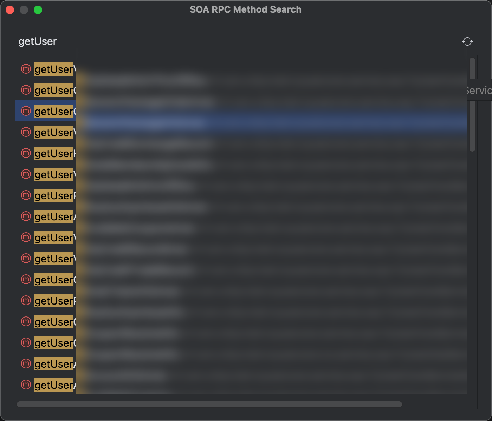
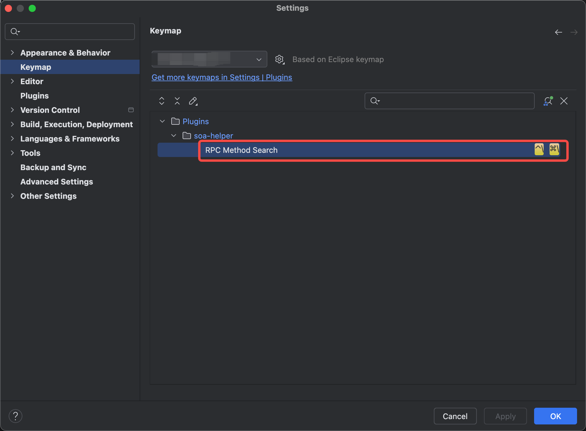

# soa-helper-plugin

## 插件介绍

### 全局快速跳转SOA

携程SOA服务方法搜索框全局唤醒+快速搜索跳转：

无搜索词时，搜索框下方展示最近跳转服务方法的历史记录。

全局唤起搜索框快捷键：
- MacOS: `command+\`
- Windows: `ctrl+\`

如果不生效可能是因为快捷键被占用了，修改插件对应快捷键即可：

### SOA方法快速跳转浏览器

#### 功能说明
SOA Helper 插件现在支持灵活的跳转配置功能。你可以在设置中配置多个跳转选项，每个选项可以定义自己的 URL 模板，支持变量替换和函数调用。

#### 使用方法
- [JUMP_CONFIG_GUIDE.md](doc/JUMP_CONFIG_GUIDE.md)